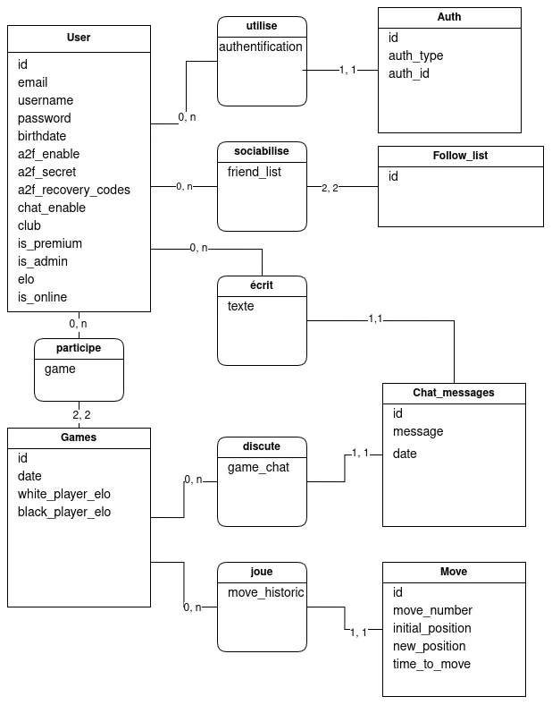

_This project has been created as part of the 42 curriculum by nmartin, yamartin, joudafke, braugust, maissat_

# Team organisatiom

## Roles

Product Owner (PO): _nmartin_
As a product owner, I decided with my teammates the project subject (checkers game).
I discuss with my team and decided wich modules and features were pertinents to do according to the project and our preferences.
With the Project Manager, we established roles and work repartitions between each members, priority order of modules and features and tracked their progression.
Also I regularly discuss with each members of the group to see their work, its compatility with the global code and to merge it with github.

Project Manager (PM) / Scrum Master: _joudafke_


Technical Lead / Architect: _maissat_


Developers: all team members


## Work repartition

## Technologies

## Modules

# Ft_checkmate

## Database _by nmartin_

For the database, we decided to use PostgreSQL for its pertinence to learn how to use it on the market, for its efficienty and for his usage of SQL langage.
To establish a communication between the database and the beackend, we decided to use a Object-Relational Mapping (ORM).
Using a ORM makes this task easier and more instinctive, its also a minor module.
The most pertinent ORM to learn on the market according to us is Prisma.
Prisma is synchronized with the database, he convert its code automaticcaly into SQL commands who are send to the database.

### Schematization

A well organized database is an important pillar to build a project like ours.
Before any code, visualize the needs of our project is important to get a global vision and getting a strong database structure.
I found a platform who make schema realization easier: draw.io.



This schema is a Conceptual Data Model (CDM).
Its goal is to establish the differents tables of our database, the differents elements composing each and the relation between those tables.


This schema is a Logical Data Model (LDM).
Its goal is to get a global vision closer to prisma's models.
It is similar to the CDM, adding differents constraints (unique, check, not null...) and foreign keys.

Those schemas make the implementation of prisma (and globally the entire code) easier and more intuitive.

### Interaction

As we said, Prisma permits an interaction between database and backend.
We need to start with a `schema.prisma` file who is a translation of our precedent schemas in code.
```generate schema.prisma file and nescessary files
npx prisma init --datasource-provider postgresql
```
Next, Prisma generates a `migraton.sql` file who is a translation of our code in SQL.
```generate migration.sql
npx prisma migrate dev --name add_constraints --create-only
```
We add our constraints in SQL langage and we send this `.sql` file to our database.
```apply migration.sql
npx prisma migrate dev
```
Our backend is now in communication with our database with functions like `find`,`update`,`delete`.

# Documentation
-- Database

https://www.youtube.com/watch?v=iHKE_4KeNWQ&list=PLjwdMgw5TTLXXpRlzDZq7d8iS6YXgnslt&pp=0gcJCdAEOCosWNin

https://youtu.be/qw--VYLpxG4?si=kX9xEN0Cez4mfPrK

https://www.postgresql.org/docs/

https://youtu.be/RebA5J-rlwg?si=_ajJHgS3vmEiO95y

https://www.prisma.io/docs