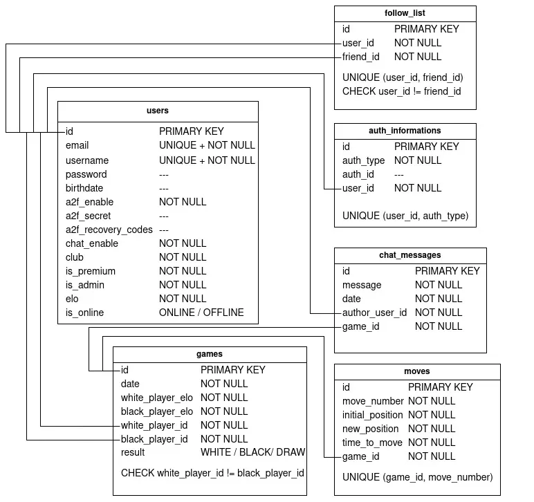

_This project has been created as part of the 42 curriculum by nmartin, yamartin, joudafke, braugust, maissat_

# Ft_checkmate

## Description

Ft_checkmate is a real-time multiplayer checkers game (jeu de dames) built as a full-stack web application. Two players can compete against each other online from separate computers, with full French checkers rules enforced server-side.

**Key features:**
- Real-time online multiplayer checkers game
- User authentication (email/password, Google OAuth, 2FA)
- User profiles with ELO ranking, match history, and friends system
- Leaderboard and matchmaking system
- Internationalization (French, English, Arabic)
- Full containerization with Docker

---

# Team Organisation

## Roles

**Product Owner (PO):** _nmartin_
As a product owner, I decided with my teammates the project subject (checkers game).
I discuss with my team and decided which modules and features were pertinent to do according to the project and our preferences.
With the Project Manager, we established roles and work repartitions between each members, priority order of modules and features and tracked their progression.
Also I regularly discuss with each members of the group to see their work, its compatibility with the global code and to merge it with github.

**Project Manager (PM) / Scrum Master:** _joudafke_
As project manager and Scrum master, I was responsible for the team's coordination and for keeping the project on track.
I organized our team meetings and planning sessions, and made sure everyone knew what to work on and by when.
Together with the Product Owner, I established the roles and work repartition between each member, and I tracked the progression of the modules and features to keep our deadlines realistic.
I facilitated communication within the team and handled the risks and blockers as they came up, so that each member could stay focused on their tasks.

**Technical Lead / Architect:** _maissat_
As technical lead, I was responsible for the overall front-end architecture and technical choices of the project.
I chose the front-end stack (Next.js, TypeScript, React, Tailwind CSS, shadcn/ui) and set up the App Router structure, deciding how pages, layouts, and locales would be organized across the codebase.
I defined the visual direction (DA) of the site and made sure it stayed consistent across every page, so teammates building new features had clear styling conventions to follow.
I built the core shared components (Topbar, Footer, modals) that the rest of the app depends on.

**Developers:** all team members

## Work Repartition

| Member | Role | Main contributions |
|--------|------|--------------------|
| nmartin | PO + Developer | Database schema, Prisma ORM, project management |
| joudafke | PM + Developer | Authentication (login, register, OAuth, 2FA), backend routes |
| maissat | Tech Lead + Developer | Front-end architecture, UI/UX, shared components |
| braugust | Developer | Server-side game engine, Docker, HTTPS, i18n, avatar system |
| yamartin | Developer | Client-side game logic, WebSocket client, game UI |

## Project Management

- Communication via Discord (daily updates, code reviews, blockers)
- Work organized by feature branches on GitHub (`database`, `front`, `game`, `brice`, etc.)
- Regular syncs between members before merging branches
- GitHub used for version control with meaningful commit messages per member

---

# Technical Stack

## Frontend
- **Next.js 16** (App Router) — full-stack React framework
- **React** — UI component library
- **TypeScript** — static typing
- **Tailwind CSS** — utility-first CSS framework
- **shadcn/ui** — reusable UI components
- **next-intl** — internationalization (FR/EN/AR)
- **socket.io-client** — WebSocket client for real-time game

## Backend
- **Next.js API Routes** — REST API endpoints
- **Node.js custom server** — socket.io WebSocket server integrated with Next.js
- **socket.io** — real-time bidirectional communication
- **NextAuth.js** — authentication (session management, OAuth)
- **Prisma v7** — ORM for database interaction
- **argon2** — password hashing

## Database
- **PostgreSQL 16** — relational database
- Chosen for its reliability, SQL standard compliance, and strong ecosystem

## Infrastructure
- **Docker & Docker Compose** — full containerization
- **Nginx** — reverse proxy with HTTPS termination
- **ngrok** — external HTTPS tunnel for evaluations

---

# Modules

| # | Module | Category | Type | Points | Implemented by |
|---|--------|----------|------|--------|----------------|
| 1 | Framework front + back (Next.js) | Web | Major | 2 pts | maissat |
| 2 | Real-time WebSockets (socket.io) | Web | Major | 2 pts | yamartin, braugust |
| 3 | Complete web-based game (checkers) | Gaming | Major | 2 pts | yamartin, braugust |
| 4 | Remote players (2 PCs in real-time) | Gaming | Major | 2 pts | yamartin, braugust |
| 5 | ORM (Prisma) | Web | Minor | 1 pt | nmartin |
| 6 | i18n 3 languages (fr/en/ar) | Accessibility | Minor | 1 pt | braugust |
| 7 | OAuth Google | User Management | Minor | 1 pt | joudafke |
| 8 | 2FA (OTP by email + recovery codes) | User Management | Minor | 1 pt | joudafke |
| 9 | Stats & match history | User Management | Minor | 1 pt | nmartin, joudafke |

**Total: 4 majors (8 pts) + 5 minors (5 pts) = 13 points**

---

# Ft_checkmate

## Database _by nmartin_

For the database, we decided to use PostgreSQL for its pertinence to learn how to use it on the market, for its efficiency and for its usage of SQL language.
To establish a communication between the database and the backend, we decided to use a Object-Relational Mapping (ORM).
Using an ORM makes this task easier and more instinctive, it's also a minor module.
The most pertinent ORM to learn on the market according to us is Prisma.
Prisma is synchronized with the database, it converts its code automatically into SQL commands which are sent to the database.

### Schematization

A well organized database is an important pillar to build a project like ours.
Before any code, visualizing the needs of our project is important to get a global vision and getting a strong database structure.
I found a platform which makes schema realization easier: draw.io.


This schema is a Conceptual Data Model (CDM).
Its goal is to establish the different tables of our database, the different elements composing each and the relation between those tables.



This schema is a Logical Data Model (LDM).
Its goal is to get a global vision closer to prisma's models.
It is similar to the CDM, adding different constraints (unique, check, not null...) and foreign keys.

Those schemas make the implementation of Prisma (and globally the entire code) easier and more intuitive.

### Interaction

As we said, Prisma permits an interaction between database and backend.
We need to start with a `schema.prisma` file which is a translation of our precedent schemas in code.

```bash
npx prisma init --datasource-provider postgresql
```

Next, Prisma generates a `migration.sql` file which is a translation of our code in SQL.

```bash
npx prisma migrate dev --name add_constraints --create-only
```

We add our constraints in SQL language and we send this `.sql` file to our database.

```bash
npx prisma migrate dev
```

Our backend is now in communication with our database with functions like `find`, `update`, `delete`.

---

## Infrastructure & Deployment _by braugust_

### Overview

The infrastructure ensures the entire application can be launched with a single command, runs securely over HTTPS, and connects all services together reliably.

### Docker Setup

The application is fully containerized using Docker Compose with three services communicating over an internal network:

- **db** — PostgreSQL 16 database with health checks to ensure readiness before dependent services start
- **frontend** — Next.js application with automatic Prisma migration on startup
- **nginx** — Reverse proxy handling HTTPS termination

```bash
docker compose up --build
```

This single command builds all images, applies database migrations, and starts the full stack.

**Key implementation details:**
- Prisma `migrate deploy` runs automatically at container startup via the `CMD` instruction in the Dockerfile
- The generated Prisma client is copied from `packages/node_modules/.prisma` to `/app/node_modules/.prisma` to ensure Next.js can locate it at runtime
- Health checks on the `db` service prevent the frontend from starting before PostgreSQL is ready
- A `prisma.config.ts` placed at `packages/` level provides the `datasource.url` required by Prisma v7 for migrations

### HTTPS with Nginx

A self-signed SSL certificate is generated locally for `localhost`:

```bash
openssl req -x509 -nodes -days 365 -newkey rsa:2048 \
  -keyout nginx/certs/localhost.key \
  -out nginx/certs/localhost.crt \
  -subj "/CN=localhost"
```

Nginx listens on ports 80 and 443:
- HTTP (port 80) redirects automatically to HTTPS
- HTTPS (port 443) proxies requests to the Next.js frontend on port 3000 (internal Docker network only)

### Environment Configuration

Credentials are stored in a local `.env` file (never committed) following the `.env.example` template:

```env
POSTGRES_DB=
POSTGRES_USER=
POSTGRES_PASSWORD=
DATABASE_URL=postgresql://USER:PASSWORD@db:5432/ft_checkmate
RESEND_API_KEY=
GOOGLE_CLIENT_ID=
GOOGLE_CLIENT_SECRET=
NEXTAUTH_SECRET=
NEXTAUTH_URL=https://localhost
```

---

## Internationalization (i18n) _by braugust_

The application supports three languages: French (default), English, and Arabic.

The i18n system is built with **next-intl**, integrated directly into the Next.js App Router.

```
messages/
├── fr.json    ← French translations
├── en.json    ← English translations
└── ar.json    ← Arabic translations
```

All routes are prefixed with the locale:
```
/fr/profile    ← French
/en/profile    ← English
/ar/profile    ← Arabic
```

The middleware handles auth protection and locale routing simultaneously. Language switcher (FR / EN / AR) available in the navbar.

---

## Game _by yamartin & braugust_

### Overview

Ft_checkmate implements a fully functional online checkers game (jeu de dames) playable in real-time between two players through a web browser.

### Game Features

**Board & Pieces**
- 8×8 checkerboard with alternating dark and light squares
- Black pieces (player 1) start on the first 3 rows, white pieces (player 2) on the last 3 rows
- Visual distinction between regular pieces and kings (gold border)

**Game Rules (French checkers)**
- Diagonal movement only, on dark squares
- Black pieces move downward, white pieces move upward
- Mandatory capture (prise forcée): if a capture is available, the player must take it
- Multi-capture chains: after a capture, if another capture is possible, the player must continue
- King promotion: a piece reaching the last row becomes a king (dame)
- Kings can move and capture in all 4 diagonal directions
- Long-distance king movement: kings can move multiple squares in one direction
- Long-distance king capture: kings can jump over an enemy piece anywhere on the diagonal

**Multiplayer & Real-time**
- Two players connect to the same game room via WebSocket (socket.io)
- Each player is assigned a color (black or white) from the database
- Real-time board synchronization: every move is instantly reflected on both screens
- Server-side move validation: the server verifies every move using `checkers.js` before applying it
- Turn enforcement: a player cannot move if it is not their turn
- 30-second timer per turn: if the timer runs out, the player loses by forfeit
- Graceful disconnection handling

**Win / End conditions**
- A player wins when the opponent has no more legal moves
- Draw by material (king vs king with no progress)
- Draw by inactivity (10 turns without a capture)
- Timeout forfeit

**UI & UX**
- Click to select a piece, click destination to move
- Selected piece highlighted with a yellow outline
- Turn indicator and countdown timer displayed
- Piece capture counters for both players
- Game over screen with winner announcement

### Technical Implementation

**Client side** (`src/app/[locale]/game/[gameId]/page.tsx`, `src/components/OnlineGameClient.tsx`) — _by yamartin_
- Built with React (Next.js App Router), TypeScript, Tailwind CSS
- `useState` for board state, selected piece, turn, timer, eaten counters
- `useEffect` with socket.io-client for real-time WebSocket connection
- Click handler validates piece ownership before sending move to server
- Receives `init`, `state`, `timer`, `gameover`, `error` events from server

**Server side** (`server.js`, `src/lib/checkers.js`) — _by braugust_
- Custom Next.js server with socket.io integrated on the same HTTP server
- Dynamic game rooms identified by `gameId` from the database
- Player color assigned from database (not by connection order)
- `checkers.js`: complete game engine — `legalMoves`, `applyMove`, `isDrawByMaterial`, `makeFreshBoard`
- Per-turn countdown timer with automatic forfeit on timeout
- Results pushed to database after each game (ELO calculation)
- Maximum 2 players per room enforced server-side

---

## Avatar System _by braugust_

Users can personalize their profile picture, either by uploading their own image or by choosing from a set of built-in avatars.

**Custom upload**
- Upload an image directly from the user's computer
- Live preview before confirming the change

**Built-in avatar gallery**
- 5 default avatars matching the four club colors plus a neutral one
- Single-click selection, currently selected avatar highlighted

**Validation & security**
- Allowed formats: PNG, JPG, JPEG, WEBP — max 2 MB
- Binary signature (magic number) verification to reject disguised files
- Database only updated once the file is safely written

---

## Individual Contributions

### nmartin — Product Owner & Developer
- Defined project scope, modules, and feature priorities
- Designed and implemented the database schema (PostgreSQL + Prisma)
- Managed GitHub merges and team coordination
- Implemented game statistics backend (ELO calculator, match history)

### joudafke — Project Manager & Developer
- Coordinated team meetings, tracked deadlines, managed blockers
- Implemented user authentication (login, register, sessions)
- Implemented Google OAuth 2.0
- Implemented 2FA (OTP by email + recovery codes)
- Implemented the user profile, parameters page, and friends system
- Contributed to game statistics and match history

### maissat — Technical Lead & Developer
- Chose and set up the front-end stack (Next.js, TypeScript, React, Tailwind CSS, shadcn/ui)
- Designed and implemented the overall visual direction across all pages
- Built the Topbar, Footer, LoginModal, RegisterModal, NotifModal
- Structured the App Router with locale-aware layouts

### braugust — Developer
- Built the complete server-side game engine (`checkers.js`) with full French checkers rules
- Implemented the custom Node.js/socket.io server with dynamic room management
- Handled player authentication via JWT cookie verification
- Implemented per-turn countdown timer with forfeit logic
- Integrated game results with the database (ELO calculation, match history)
- Set up the complete Docker infrastructure (PostgreSQL, Next.js, Nginx)
- Configured HTTPS with self-signed SSL certificates via Nginx
- Solved Prisma v7 migration compatibility in Docker
- Implemented full i18n (FR/EN/AR) with next-intl and locale-aware routing
- Built the avatar system with custom upload and built-in gallery
- Set up ngrok for external HTTPS access during evaluations

### yamartin — Developer
- Built the complete checkers game client from scratch (React/Next.js)
- Implemented board rendering, piece selection, and click handler logic
- Integrated socket.io client for real-time WebSocket communication
- Built the game UI: turn indicator, timer, piece counters, win/loss screen, replay button
- Learned React, Next.js, TypeScript, and WebSockets from scratch during this project

---

# Instructions

## Prerequisites

- Docker & Docker Compose installed
- Git

## Setup

1. Clone the repository:
```bash
git clone https://github.com/nmartin-git/ft_checkmate.git
cd ft_checkmate
```

2. Create your `.env` file from the template:
```bash
cp .env.example .env
```

3. Fill in the required values in `.env`:
```env
POSTGRES_DB=ft_checkmate
POSTGRES_USER=your_user
POSTGRES_PASSWORD=your_password
DATABASE_URL=postgresql://your_user:your_password@db:5432/ft_checkmate
RESEND_API_KEY=your_resend_key
GOOGLE_CLIENT_ID=your_google_client_id
GOOGLE_CLIENT_SECRET=your_google_client_secret
NEXTAUTH_SECRET=a_long_random_string
NEXTAUTH_URL=https://localhost
```

4. Launch the full stack:
```bash
docker compose up --build
```

5. Open your browser at [https://localhost](https://localhost)

> The browser will show a security warning for the self-signed certificate — click "Advanced" then "Proceed to localhost" to continue.

## External access (evaluations)

```bash
ngrok config add-authtoken YOUR_TOKEN
ngrok http 443 --scheme https
```

Share the generated URL with the evaluator.

---

# Documentation

## Database
- https://www.youtube.com/watch?v=iHKE_4KeNWQ&list=PLjwdMgw5TTLXXpRlzDZq7d8iS6YXgnslt
- https://youtu.be/qw--VYLpxG4?si=kX9xEN0Cez4mMprK
- https://www.postgresql.org/docs/
- https://youtu.be/RebA5J-rlwg?si=_ajJHgS3vmEiO95y
- https://www.prisma.io/docs

## Infrastructure & i18n
- https://docs.docker.com/compose/
- https://nginx.org/en/docs/
- https://next-intl-docs.vercel.app/

## Game & Real-time
- https://socket.io/docs/v4/
- https://nextjs.org/docs
- https://react.dev/

## Authentication
- https://next-auth.js.org/

## AI Usage
AI tools were used by some team members as a learning and debugging during development.
